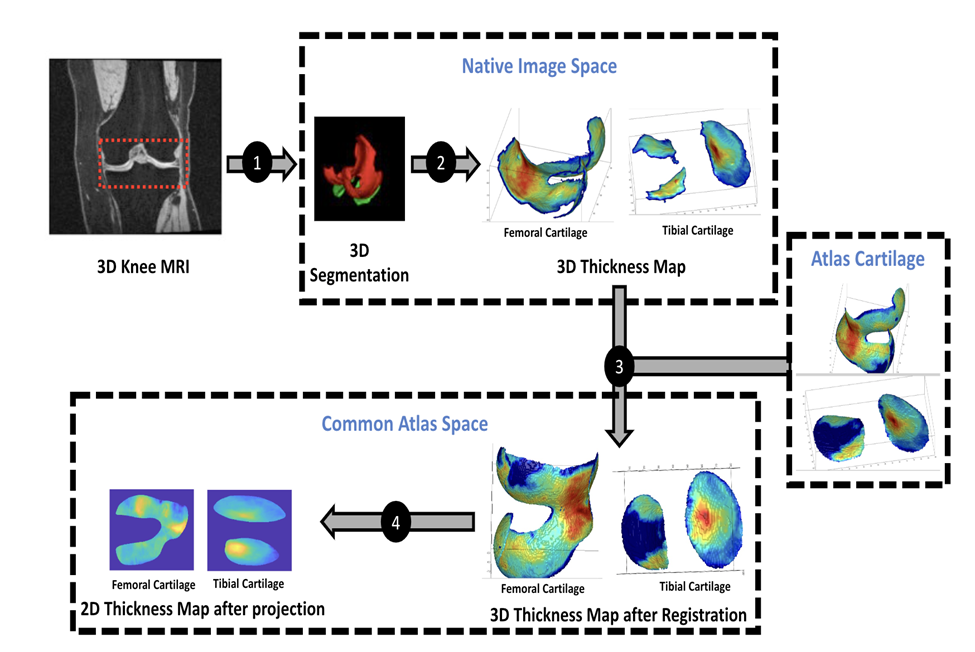

# OAI Analysis 2

[](https://github.com/uncbiag/OAI_analysis_2/actions)
[](https://pypi.org/project/oai-analysis)
[](https://pypi.org/project/oai-analysis)

**Table of Contents**

- [Installation](#installation)
- [Introduction](#introduction)
- [Development](#development)
- [Citation](#citation)
- [Acknowledgements](#acknowledgements)
- [License](#license)

## Installation

```console
pip install oai-analysis
```

## Introduction

This repository contains open-source analysis approaches for the [Osteoarthritis Initiative (OAI)](https://nda.nih.gov/oai/) magnetic resonance image (MRI) data.
The analysis code is largely written in Python with the help of [ITK](http://itk.org) and [VTK](http://vtk.org) for data I/O and mesh processing
as well as [PyTorch](http://pytorch.org) for the deep learning approaches for segmentation and registration. The initial development of this work
was led by [UNC Chapel Hill](http://biag.cs.unc.edu) as well as [Kitware](http://kitware.com). This work is also an outgrowth of conversations within the
[Community for Open and Reproducible Musculoskeletal Imaging Research (JC|MSK)](https://jcmsk.github.io/). Going forward, contributions by the 
broader community are, of course, not only welcome but encouraged.

### Main functionality
1. **Deep Learning Segmentation**: Automatic cartilage segmentation (femoral and tibial cartilage) using a 3D UNet.
2. **Deep Learning Atlas registration**: Registration of the cartilage meshes with associated cartilage thickness to a knee atlas space via a deep registration network for 3D images.
3. **Cartilage thickness**: Extraction of femoral and tibial cartilage meshes and measuring of cartilage thickness based on a closest-point thickness estimation.
4. **2D thickness mapping**: Mapping of the thickness maps to a common 2D atlas space which provides full spatial correspondence. This is achieved via unrolling (based on a cylindrical coordinate system) for the femoral cartilage and a planar projection for the tibial cartilage.
5. **Statistical analysis**: [Longitudinal statistical analysis approaches are planned]

### Pipeline steps:
1. Read image
 a. Read
 b. Put into canonical orientation
 c. Intensity preprocess (rescale to 0-1)
2. Segment cartilage using deep learning  
3. Register patient image to atlas image.  
4. Transform patient mesh into atlas space using registration transform  
5. Split the mesh into inner and outer surfaces in atlas space
  a. Island filtering (keep largest + islands close to atlas mesh)
  b. Mesh smoothing
  c. Clustering into inner and outer surface
6. Transform the inner and outer meshes back to patient space  
7. Measuring the thickness by computing distances between inner and outer surfaces
8. Transfer thicknesses from patient mesh to atlas mesh by iterating over atlas vertices and finding the closest patient vertex
9. Project atlas mesh to 2D using precomputed mapping



### Difference between OAI Analysis and OAI Analysis 2

The analysis approaches in this repository are based on our initial [OAI Analysis](https://github.com/uncbiag/OAI_analysis) work.
Much of the functionality of the original code-base has been ported to the *OAI Analysis 2* repository. The main differences are
1. **Refactoring**: A significant refactoring of the code so that it makes better use of [ITK](http://itk.org) conventions as well as [VTK](http://vtk.org) for all the mesh processing needs.
2. **uniGradICON registration**: We switched to the new [uniGradICON](https://github.com/uncbiag/uniGradICON) registration approach (see manuscripts below).
3. **Data processing**: We improved the data processing by better handling of data objects. Whereas the previous *OAI Analysis* pipeline largely depended on reading and writing various different files, the *OAI Aanalysis 2* refactoring uses ITK and VTK objects.
4. **Jupyter notebooks**: Better support of analysis in Jupyter notebooks.

We are currently working on the following features which should be available in the near future:
1. **Distributed processing**: Whereas *OAI Analysis* was set up for cluster computing via a simple SLURM script OAI Analysis 2 is moving toward using [Dask](https://dask.org/) to allow for parallel processing on clusters and the cloud.
2. **Workflow management**: Whereas *OAI Analysis* used custom code to avoid recomputing results, we are switching to [Dagster](https://dagster.io/) to manage data dependencies in *OAI Analysis 2*. Current progress is [here](https://github.com/PaulHax/knee-sarg).
3. **Distribution of analysis results**: As we are planning on not only distributing code, but also analysis results (such as segmentations, meshes, thickness maps) we are planning on supporting data access via the [Interplanetary File System (IPFS)](https://ipfs.io/).

## Development

Contributions are appreciated and welcome.

```
git clone https://github.com/uncbiag/OAI_analysis_2
cd OAI_analysis_2
pip install -e .
pip install pytest
pytest
```

To view the demo notebooks:
```
cd notebooks
jupyter notebook
```

upload test data to https://data.kitware.com/#collection/6205586c4acac99f42957ac3/folder/620559344acac99f42957d63

## Citation

We now use registration approach available in [uniGradICON](https://github.com/uncbiag/uniGradICON) for *OAI Analysis*
[paper](https://arxiv.org/abs/2403.05780)
```
@article{tian2024unigradicon,
  title={uniGradICON: A Foundation Model for Medical Image Registration},
  author={Tian, Lin and Greer, Hastings and Kwitt, Roland and Vialard, Francois-Xavier and Estepar, Raul San Jose and Bouix, Sylvain and Rushmore, Richard and Niethammer, Marc},
  journal={arXiv preprint arXiv:2403.05780},
  year={2024}
}
```

An overview of the analysis framework is available as a [QMSKI](https://qmski.org/) conference [abstract](https://www.researchgate.net/publication/361754685_Reproducible_Workflow_for_Visualization_and_Analysis_of_OsteoArthritis_Abnormality_Progression)
```
@InProceedings{Sahu_2022_QMSKI,
author    = {Sahu, Pranjal and Greer, Hastings and Xu, Zhenlin and Shen, Zhengyang and Bonaretti, Serena and McCormick, Matt and Niethammer, Marc},
title     = {Reproducible Workflow for Visualization and Analysis of OsteoArthritis Abnormality Progression},
booktitle = {Proceedings of the International Workshop on Quantitative Musculoskeletal Imaging (QMSKI)},
year      = {2022}
}
```

Results obtained by the *OAI Analysis* pipeline can be found in this manuscript
[[paper]](https://www.sciencedirect.com/science/article/pii/S1361841521003881?casa_token=Pgx9BQD4H_4AAAAA:P91yIWLkxXp_ZzLURL7LGSyrdqFJ-QARRTKSq5IoyQ8uGHUc221-hWNoL8ObpvQuls1JBZ4)
```
@article{huang2022dadp,
  title={DADP: Dynamic abnormality detection and progression for longitudinal knee magnetic resonance images from the Osteoarthritis Initiative},
  author={Huang, Chao and Xu, Zhenlin and Shen, Zhengyang and Luo, Tianyou and Li, Tengfei and Nissman, Daniel and Nelson, Amanda and Golightly, Yvonne and Niethammer, Marc and Zhu, Hongtu},
  journal={Medical Image Analysis},
  pages={102343},
  year={2022},
  publisher={Elsevier}
}
```

## Acknowledgements

This work was developed with support in part from the National Institute of Arthritis and Musculoskeletal and Skin Diseases (NIAMS) 
under award numbers [1R44AR074375](https://reporter.nih.gov/search/Naf5qSR3eUStFkMfGm6KpQ/project-details/9777582), [1R01AR072013](https://reporter.nih.gov/search/eE7eB34dVUGoY1nLF3kZNA/project-details/9368542), and [1R01AR082684](https://reporter.nih.gov/search/TdbftRplwU-HPeF3spFejw/project-details/10822142).

## License

This is distributed under the terms of the [Apache-2.0](https://spdx.org/licenses/Apache-2.0.html) license.
